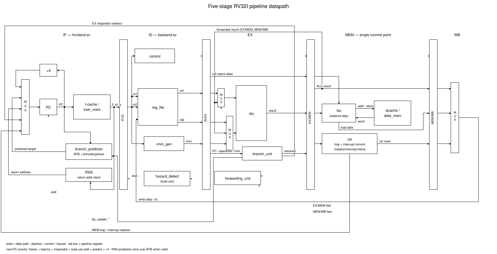
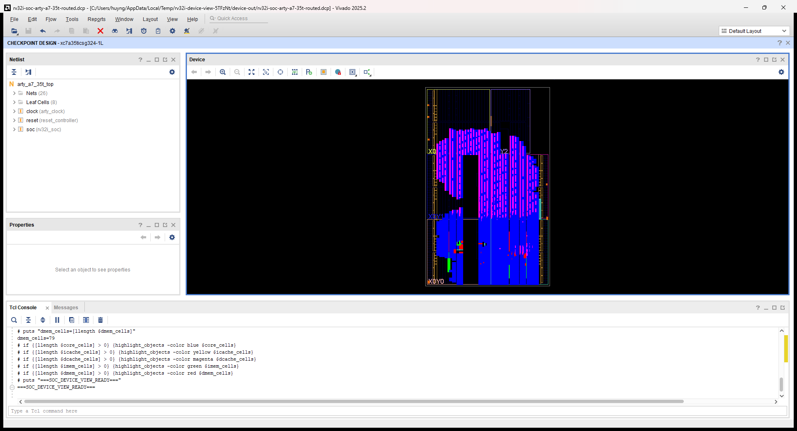
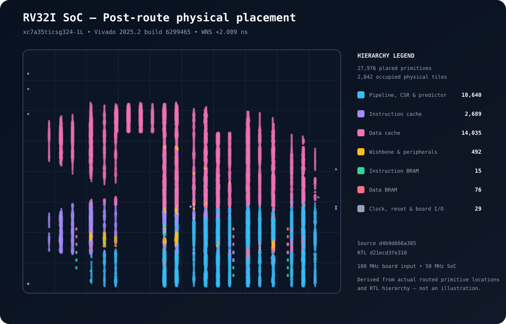

# VeriCore — Verified RV32I FPGA SoC

A synthesis-tested 5-stage RISC-V core with caches, precise traps, and retirement-level verification.

[](https://github.com/HuyHuy-bit/vericore-verified-rv32i-fpga-soc/actions/workflows/rtl-tests.yml)
[](https://github.com/HuyHuy-bit/vericore-verified-rv32i-fpga-soc/actions/workflows/compliance.yml)
[](https://github.com/HuyHuy-bit/vericore-verified-rv32i-fpga-soc/actions/workflows/lockstep.yml)
[](LICENSE)

**38/38 architecture tests and 200/200 random programs match Spike instruction-for-instruction at retirement.**

`RV32I_Zicsr_Zifencei` in SystemVerilog: forwarding, branch prediction, M-mode traps and interrupts, parameterized I/D caches. Every number below is generated from committed records bound to exact tool and source revisions.



<!-- portfolio:status:start -->
Measurement
<!-- portfolio:status:end -->

<!-- portfolio:soc:start -->
Physical-board evidence: not published
<!-- portfolio:soc:end -->

<!-- portfolio:snapshot:start -->
> **Portfolio Snapshot** — 5-stage `RV32I_Zicsr_Zifencei` • 25 directed tests × 6 memory configurations • 3 predictor configurations • 38/38 architecture signatures • 38/38 Spike lockstep • 200/200 random Spike seeds • 66 assertions • 44/44 functional cover points • 70.6–76.3 MHz routed Artix-7 implementations
<!-- portfolio:snapshot:end -->

<!-- portfolio:verification:start -->
| Metric | Value | How measured |
|---|---:|---|
| Decoder unit vectors | 2,120/2,120 | `make unit` |
| Hazard unit vectors | 262,144/262,144 | `make unit` |
| Harness tests | 109/109 | `make harness-test` |
| Directed memory matrix | 150/150 | `make verify` |
| Predictor matrix | 75/75 | `make predictor-test` |
| Architecture signatures | 38/38 | `make compliance` |
| Architecture Spike lockstep | 38/38 | `make lockstep` |
| Python-model random | 2000/2000 | `make soak SEEDS=1000` |
| Random Spike lockstep | 200/200 | `make soak-lockstep SEEDS=200` |
| Functional cover points | 44/44 | `make coverage` |
<!-- portfolio:verification:end -->

Redirect priority is `freeze > trap > mispredict > load-use stall > predict > PC+4`. Validity is carried from fetch to commit, so flushed instructions cannot touch architectural state, counters, or traces.

## Core design

- 5-stage, single-issue, in-order, with EX/MEM and MEM/WB forwarding and operand-aware load-use stalls.
- 64-entry BTB with 2-bit counters, optional gshare, 8-entry return-address stack. Branches resolve in EX; traps redirect at one commit point.
- Machine CSRs, `ECALL`, `EBREAK`, `MRET`, `mcycle`, `minstret`, and precise illegal-instruction and misaligned exceptions with `mepc`, `mcause`, `mtval`.
- Parameterized cache capacity, block size and associativity, write-through and write-back policies. `FENCE.I` invalidates the I-cache and restarts fetch.

## Board-ready SoC

The external-memory core sits behind a Wishbone fabric with 32 KiB instruction/data BRAMs, a transmit-only UART, four LEDs and a debounced interrupt input for the Arty A7-35T. The firmware simulator verifies the boot message, bounce rejection, two interrupt responses, LED changes and execution after `MRET`.



The Vivado 2025.2 Device window from the routed `xc7a35ticsg324-1L` checkpoint, with hierarchy overlays. Hashes in [soc-vivado-device.json](docs/images/soc-vivado-device.json). Implementation evidence, not proof of operation on a physical board.



Generated from actual Vivado post-route primitive locations and RTL hierarchy — not a conceptual CPU illustration. Provenance is in [soc-floorplan.json](docs/images/soc-floorplan.json).

```bash
make soc-check
make soc-bitstream
```

See the [Board-ready SoC](docs/soc.md) guide for the memory map, bus contract, firmware, and programming flow.

## Quick start

Docker is the only host requirement.

```bash
git clone https://github.com/HuyHuy-bit/vericore-verified-rv32i-fpga-soc.git
cd vericore-verified-rv32i-fpga-soc
make verify
```

`make verify` runs the complete open-source profile in the pinned container; `make check` is the faster inner loop.

## Verification

The simulator accepts only explicit completion modes and rejects malformed references, bad `tohost` values, timeouts, incomplete traces and stale outputs. Spike lockstep compares complete retirement streams; architecture signatures are an independent external source. See [verification.md](docs/verification.md).

A terminal recording of the verification workflow — not FPGA board footage:


## Measured performance

Benchmarks are `cycles / CPI`. Synthesis used Vivado 2025.2 on `xc7a35ticsg324-1L` with a deliberately aggressive 2 ns constraint, so negative WNS is expected; fmax is derived from the routed critical path.

<details>
<summary>Benchmark matrix</summary>

<!-- portfolio:benchmarks:start -->
| Kernel | 10-cycle uncached | +1KB 4-way I$ | +4KB 4-way WB D$ | 1-cycle uncached |
|---|---:|---:|---:|---:|
| crc32 | 758,160 / 10.28041 | 151,765 / 2.05789 | 152,021 / 2.06136 | 75,816 / 1.02804 |
| matmul | 3,504,148 / 11.37629 | 710,907 / 2.30797 | 711,691 / 2.31052 | 361,402 / 1.17330 |
| sort | 2,227,300 / 11.02875 | 471,714 / 2.33575 | 504,610 / 2.49864 | 252,106 / 1.24833 |
| llist | 932,270 / 10.00236 | 186,587 / 2.00190 | 187,611 / 2.01289 | 93,227 / 1.00024 |
| interp | 14,652,250 / 11.69906 | 2,932,916 / 2.34178 | 2,933,124 / 2.34195 | 1,467,250 / 1.17152 |
<!-- portfolio:benchmarks:end -->

</details>

<details>
<summary>Routed Artix-7 matrix</summary>

<!-- portfolio:synthesis:start -->
| Configuration | LUT | FF | BRAM tiles | WNS (ns) | Critical path (ns) | fmax (MHz) |
|---|---:|---:|---:|---:|---:|---:|
| Core | 4,031 | 5,220 | 0.5 | -11.111 | 13.111 | 76.272 |
| +1KB 4-way I$ | 5,011 | 6,970 | 2.0 | -11.563 | 13.563 | 73.730 |
| +4KB 4-way WT D$ | 8,800 | 13,527 | 4.0 | -12.172 | 14.172 | 70.562 |
| +4KB 4-way WB D$ | 9,218 | 13,517 | 4.0 | -11.920 | 13.920 | 71.839 |
<!-- portfolio:synthesis:end -->

</details>

## Design notes

- The pipeline freezes globally on a memory stall; a decoupled front end is the clearest remaining performance experiment.
- Instruction memory is read-only, so self-modifying code is outside the contract.
- One external interrupt source, no PLIC; M/A/C and S/U modes are out of scope.
- Random lockstep covers control flow, not randomized traps or CSR transitions.

Full rationale and measured trade-offs are in [architecture.md](docs/architecture.md).

<details>
<summary>Machine-checked facts and provenance</summary>

<!-- portfolio:facts:start -->
<!-- evidence-facts:begin -->
EVIDENCE_FACT ISA=RV32I_Zicsr_Zifencei
EVIDENCE_FACT DIRECTED_TESTS=25
EVIDENCE_FACT ASSERTIONS_TOTAL=66
EVIDENCE_FACT ASSERTIONS_CONCURRENT=63
EVIDENCE_FACT ASSERTIONS_IMMEDIATE=3
EVIDENCE_FACT SOURCE_COVER_POINTS=44
EVIDENCE_FACT TRACKED_COVERAGE_HIT=44
EVIDENCE_FACT TRACKED_COVERAGE_TOTAL=44
EVIDENCE_FACT TRACKED_COVERAGE_STATUS=current
EVIDENCE_FACT EVIDENCE_STATUS=current
EVIDENCE_FACT SYNTHESIS_STATUS=historical
EVIDENCE_FACT CI_CONFIGS=6
EVIDENCE_FACT CI_MATRIX=baseline,slow-mem,icache-only,wt,wb,assoc
EVIDENCE_FACT ARCH_TEST_SHA=6f7f47bdc61c0c51c0cbf75789678a1235eeefc2
EVIDENCE_FACT ARCH_TEST_EXPECTED=38
EVIDENCE_FACT SPIKE_SHA=55b4658dbf574ba0b714083ec436ce2cb5be1998
EVIDENCE_FACT SPIKE_RANDOM_SEEDS=200
<!-- evidence-facts:end -->
<!-- portfolio:facts:end -->

<!-- portfolio:provenance:start -->
- Measurement timestamp: `2026-09-20T18:35:53Z`
- Tooling commit: `21df7609ef9dc746ded58762ac2d03471a291eb5`
- Frozen RTL commit: `d21ecd3fe310bf49c505220c134f8cfd205c90e5`
- Canonical container: `ghcr.io/huyhuy-bit/rv32i-verify:1`
- Open tools: Ubuntu 24.04; Verilator 5.048; RISC-V GCC 13.2.0-2024.04.12; RISC-V assembler 2.42; Python 3.12
- Vivado: 2025.2 build 6299465; `xc7a35ticsg324-1L`; measured 2026-08-29
- Reproduce verification: `make verify`
- Reproduce benchmarks: `make bench` with the recorded headline configuration
- Reproduce implementation: `make synth-matrix && make synth-summary`
<!-- portfolio:provenance:end -->

</details>

## References

- [Architecture](docs/architecture.md) · [Board-ready SoC](docs/soc.md) · [Verification plan](docs/verification.md) · [Evidence ledger](docs/evidence.md) · [Result format](results/FORMAT.md)
- [RISC-V unprivileged ISA](https://docs.riscv.org/reference/isa/unpriv/rv32.html) · [machine-level ISA](https://docs.riscv.org/reference/isa/priv/machine.html)

Licensed under the [MIT License](LICENSE).
