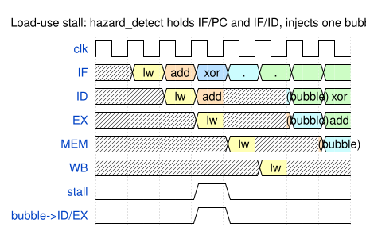
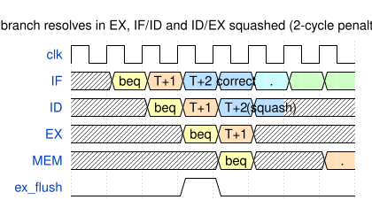
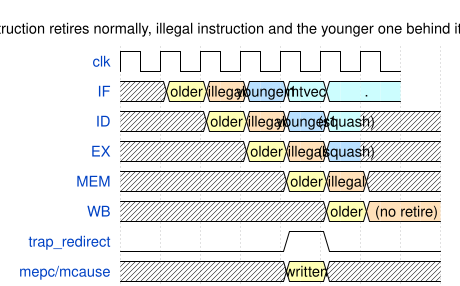
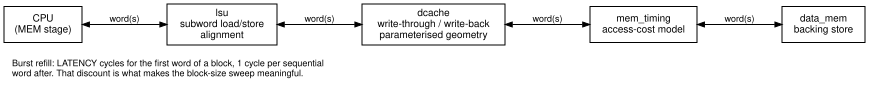
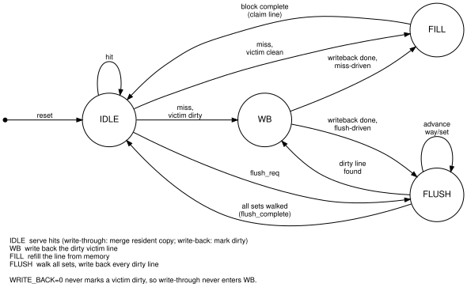

# Microarchitecture specification

A 5-stage in-order `RV32I_Zicsr_Zifencei` pipeline built for **measurable trade-offs over raw performance**: every choice below has a faster alternative that was deliberately not taken, and the point is to state what it cost.

Machine-checked repository facts

<!-- portfolio:facts:start -->
<!-- evidence-facts:begin -->
EVIDENCE_FACT ISA=RV32I_Zicsr_Zifencei
EVIDENCE_FACT DIRECTED_TESTS=25
EVIDENCE_FACT ASSERTIONS_TOTAL=66
EVIDENCE_FACT ASSERTIONS_CONCURRENT=63
EVIDENCE_FACT ASSERTIONS_IMMEDIATE=3
EVIDENCE_FACT SOURCE_COVER_POINTS=44
EVIDENCE_FACT TRACKED_COVERAGE_HIT=44
EVIDENCE_FACT TRACKED_COVERAGE_TOTAL=44
EVIDENCE_FACT TRACKED_COVERAGE_STATUS=current
EVIDENCE_FACT EVIDENCE_STATUS=current
EVIDENCE_FACT SYNTHESIS_STATUS=historical
EVIDENCE_FACT CI_CONFIGS=6
EVIDENCE_FACT CI_MATRIX=baseline,slow-mem,icache-only,wt,wb,assoc
EVIDENCE_FACT ARCH_TEST_SHA=6f7f47bdc61c0c51c0cbf75789678a1235eeefc2
EVIDENCE_FACT ARCH_TEST_EXPECTED=38
EVIDENCE_FACT SPIKE_SHA=55b4658dbf574ba0b714083ec436ce2cb5be1998
EVIDENCE_FACT SPIKE_RANDOM_SEEDS=200
<!-- evidence-facts:end -->
<!-- portfolio:facts:end -->

<!-- portfolio:status:start -->
Current measurements — validated for the checked-out RTL.
Historical synthesis — the implementation table was measured for RTL e55cf402670481413c910c2f2a51617ed53342a5; current RTL changes are not yet resynthesised.
<!-- portfolio:status:end -->

## Integration boundaries

`rv32i_core` is the memory-independent pipeline and caches. The legacy `cpu` top wraps it with `instr_mem`/`data_mem` for verification and out-of-context synthesis; `rv32i_soc` instantiates it behind Wishbone adapters, BRAMs, UART and GPIO; `arty_a7_35t_top` adds clock, reset and board wiring. See the [SoC guide](soc.md).

## Pipeline organization

IF → ID → EX → MEM → WB, one instruction wide, in order; datapath diagram in the [README](../README.md). IF looks up the BTB in parallel with fetch; ID decodes and reads registers with a same-cycle write bypass; EX resolves branches and drives the forwarding mux; MEM holds the D-cache and the single commit point for traps, `MRET` and CSR writes.

Every pipeline register carries a `valid` bit end to end, so a flushed bubble is distinguishable from a retired instruction at every stage — that is what makes the counters and precise exceptions exact rather than approximate.

## Trade-offs

**Branches resolve in EX, not ID.** ID-resolve would halve the 2-cycle penalty, at the price of an ID-stage comparator on a likely-critical path and a second forwarding network. No variant was built, so this is an argument, not a measurement.

**Global pipeline freeze, not a decoupled front end.** Any memory stall freezes PC, pipeline registers, predictor, CSRs and counters together — the single biggest structural limiter. It inflates cached and uncached CPI equally, so it does not fabricate a cache speedup, but a D-cache miss stalls fetch, which a real design avoids. A fetch buffer would touch the freeze/flush/redirect logic the precise-exception guarantees rest on.

**Both D-cache write policies** (`DCACHE_WRITE_BACK`, build-time). Write-back wins on `sort` but loses to write-through on `matmul` below 4 KB; write-through has no write buffer, so every store pays full backing-memory latency.

**Blocking caches** — one outstanding miss stalls everything behind it; an MSHR is downstream of the front-end work. **FIFO victim selection**, expected to be small at 1–4 ways, not measured. **Single MEM commit point** — precise exceptions without a reorder buffer. **BTB-gated prediction** — a branch is predicted taken only after the BTB records a taken outcome, so its first taken occurrence always mispredicts. **CSR write permission from address bits `[11:10]`**, the spec's own convention.

### Branch prediction

A 64-entry BTB with 2-bit counters, an optional gshare direction predictor (`GSHARE=1`, indexing the BHT by `PC XOR global_history`), and an 8-entry return-address stack. Both the RAS and gshare are measured against built-twice controls in [`studies.md`](studies.md): the RAS lifts a multi-caller return workload from 42.9% to 80.0% accuracy, and gshare lifts a correlated-branch workload from 49.2% to 86.7%. The RAS is speculative — push/pop happen at fetch and a flush does not roll the stack back.

### FENCE.I

Handled at the same commit point as traps: pulse `icache_invalidate`, redirect to `pc+4`. The redirect is the load-bearing half — by the time the fence reaches MEM the instructions behind it are already fetched, possibly from the lines being invalidated. Measured cost and its limits are in [`studies.md`](studies.md); both integrations prevent stores to code space, so `FENCE.I` cannot demonstrate self-modifying code here.

## Hazard and exception model

| Load-use stall | Mispredict recovery | Trap at MEM commit |
|---|---|---|
|  |  |  |

Forwarding covers distance-1 and -2 pairs; load-use costs one stall (`hazard_detect.sv`). Control hazards are predicted in IF and resolved in EX, squashing IF/ID and ID/EX. Illegal instruction, misaligned load/store/target, `ECALL`/`EBREAK` and illegal CSR access are detected in EX and committed in MEM, recording `mepc`/`mcause`/`mtval` and stacking `MIE`→`MPIE`; `MRET` reverses it. Next-PC priority: freeze > trap/MRET > mispredict > load-use stall > predicted-taken redirect > sequential.

## Memory hierarchy

`lsu.sv` handles subword load/store semantics; `dcache.sv`/`icache.sv` hold geometry and policy. `mem_timing.sv`'s burst-refill discount (full latency for the first word, 1 cycle per word after) makes the block-size sweep meaningful. The SoC treats each word as an independent Wishbone transfer, D-caches only `0x2000_0000–0x2000_7FFF`, and turns bus errors into sticky integration faults.

## Performance

<!-- portfolio:benchmarks:start -->
| Kernel | 10-cycle uncached | +1KB 4-way I$ | +4KB 4-way WB D$ | 1-cycle uncached |
|---|---:|---:|---:|---:|
| crc32 | 758,160 / 10.28041 | 151,765 / 2.05789 | 152,021 / 2.06136 | 75,816 / 1.02804 |
| matmul | 3,504,148 / 11.37629 | 710,907 / 2.30797 | 711,691 / 2.31052 | 361,402 / 1.17330 |
| sort | 2,227,300 / 11.02875 | 471,714 / 2.33575 | 504,610 / 2.49864 | 252,106 / 1.24833 |
| llist | 932,270 / 10.00236 | 186,587 / 2.00190 | 187,611 / 2.01289 | 93,227 / 1.00024 |
| interp | 14,652,250 / 11.69906 | 2,932,916 / 2.34178 | 2,933,124 / 2.34195 | 1,467,250 / 1.17152 |
<!-- portfolio:benchmarks:end -->

## Synthesis

Vivado 2025.2, `xc7a35ticsg324-1L`, 2 ns constraint, 512-word backing memories. Negative WNS is intentional — the constraint is deliberately aggressive, and `fmax` comes from each routed critical path rather than being presented as closure.

<!-- portfolio:synthesis:start -->
| Configuration | LUT | FF | BRAM tiles | WNS (ns) | Critical path (ns) | fmax (MHz) |
|---|---:|---:|---:|---:|---:|---:|
| Core | 4,031 | 5,220 | 0.5 | -11.111 | 13.111 | 76.272 |
| +1KB 4-way I$ | 5,011 | 6,970 | 2.0 | -11.563 | 13.563 | 73.730 |
| +4KB 4-way WT D$ | 8,800 | 13,527 | 4.0 | -12.172 | 14.172 | 70.562 |
| +4KB 4-way WB D$ | 9,218 | 13,517 | 4.0 | -11.920 | 13.920 | 71.839 |
<!-- portfolio:synthesis:end -->

The hierarchy fits below 45% LUT and 33% FF. Write-back costs 418 LUT over write-through for dirty-state control, at identical FF and BRAM use.

Getting the D-cache and I-cache out of flip-flops and into Block RAM took two rounds of RTL restructuring, measured step by step in [`studies.md`](studies.md). The short version: a registered read is necessary but not sufficient, per-way flat arrays are what remove the flip-flops, and a single unified write port is what finally infers RAMB18s — **`ram_style="block"` is a request, not an instruction**. The area change bought +9.8% fmax, against +0.45% from the deliberate timing optimization below, because this build is congestion-bound rather than logic-depth-bound.

## Known limitations

- **No decoupled front end, non-blocking caches, or store buffer** — each redesigns the logic the lockstep regression protects.
- **fmax is a working number** — 70.6–76.3 MHz against an aggressive 500 MHz target, no retiming attempted.
- **No external-memory controller**; the legacy wrapper uses simulation memories and the board adds Wishbone BRAM slaves.
- **Wishbone is internal** (no AXI/TileLink bridge), with one external interrupt source and no PLIC.
- **RV32 only.** `XLEN` elaborates at 64, but RV64 needs `LD`/`SD` and the `*W` forms.

Verification is covered in [`verification.md`](verification.md).
