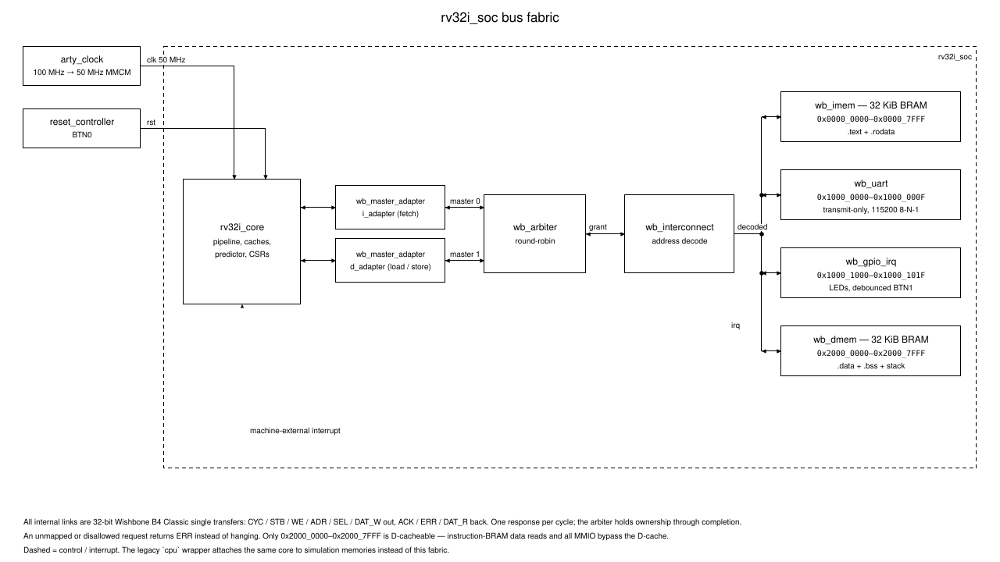

# Board-ready SoC guide

`rv32i_soc` attaches the pipeline core to a Wishbone fabric with BRAM, UART and GPIO; `arty_a7_35t_top` wraps it for the Digilent Arty A7-35T. This guide is the contract for that system.

Physical-board evidence: not published. The RTL, firmware, simulation, constraints and guarded Vivado flow exist, but nothing here claims a bitstream has run on hardware.

## Board and demo

Target is the Arty A7-35T (`xc7a35ticsg324-1L`); its 100 MHz oscillator feeds an MMCM generating the 50 MHz SoC clock. Firmware initialises the GPIO interrupt, sets LED0 and transmits `rv32i soc ready` over the USB-UART. BTN0 resets. A debounced BTN1 press raises a machine-external interrupt; the handler clears the pending bit, rotates the LEDs, transmits `external irq` and returns with `MRET`.

## System hierarchy

```text
arty_a7_35t_top                 rtl/boards/arty_a7_35t_top.sv
├── arty_clock                  100 MHz oscillator → 50 MHz SoC clock (MMCM)
├── reset_controller            BTN0
└── rv32i_soc                   rtl/soc/rv32i_soc.sv
    ├── rv32i_core              pipeline, caches, predictor, CSRs, counters
    ├── wb_master_adapter ×2    instruction and data clients
    ├── wb_arbiter              round-robin between the two masters
    ├── wb_interconnect         decode, one latched slave per transaction
    ├── wb_imem / wb_dmem       32 KiB instruction and data BRAM
    ├── wb_uart                 transmit-only UART (`uart_tx`)
    ├── button_debounce         BTN1 synchronisation and debounce
    └── wb_gpio_irq             LEDs, button state, interrupt registers
```



Two masters share one arbitration point and one decode point; every slave hangs off that single decoded transaction, and the GPIO interrupt is the only signal returning to the core outside the bus. The legacy `cpu` top wraps the same `rv32i_core` with the original memory models, preserving directed, compliance and lockstep verification.

## Bus contracts

The core exposes independent instruction and data clients; a requester holds `req`, address, write data and byte enables stable until `ready`. Instruction transfers are word reads; data writes carry lane-aligned data and one enable per byte, and the LSU extends or narrows the result. Refills issue one word at a time — `burst` is a sequential hint, not a block cycle.

The fabric is 32-bit Wishbone B4 Classic single transfers. Each adapter latches a request, aligns it to a word boundary, holds until exactly one response, and deasserts before the next; an error completes the transfer with zero data and a fault pulse. The arbiter holds ownership through completion and alternates contested grants; the interconnect latches one decoded slave per transaction, and an unmapped request returns `ERR` rather than hanging.

## Memory map and register tables

| Address range | Access | Device |
|---|---|---|
| `0x0000_0000–0x0000_7FFF` | instruction + data read | 32 KiB instruction BRAM (`.text`, `.rodata`) |
| `0x1000_0000–0x1000_000F` | data read/write | UART registers |
| `0x1000_1000–0x1000_101F` | data read/write | GPIO and external-interrupt registers |
| `0x2000_0000–0x2000_7FFF` | data read/write | 32 KiB data BRAM (`.data`, `.bss`, stack) |

Fetches are permitted only from instruction BRAM; instruction-BRAM writes, fetches elsewhere and unmapped accesses return `ERR`.

| Address | Register | Behavior |
|---|---|---|
| `0x1000_0000` | `TXDATA` | Write lane 0 transmits `[7:0]`, waiting while busy; reads return zero |
| `0x1000_0004` | `STATUS` | Read-only, bit 0 = `TX_READY` |
| `0x1000_1000` | `LED` | Read/write `[3:0]` |
| `0x1000_1004` | `BUTTON` | Read-only debounced BTN1 in bit 0 |
| `0x1000_1008` | `IRQ_PENDING` | Write 1 to bit 0 clears; a simultaneous button event wins |
| `0x1000_100C` | `IRQ_ENABLE` | Read/write enable in bit 0 |

Serial is 115200 8-N-1, idle high, LSB first; transmit-only.

## Cacheability and interrupts

The board build uses a 1 KiB four-way I-cache and a 4 KiB four-way write-back D-cache. A data address is cacheable only when `(address & 0xFFFF_8000) == 0x2000_0000` — only data BRAM. Instruction-BRAM data reads, UART, GPIO and unmapped transactions bypass the D-cache, so MMIO writes reach the device before the instruction completes, MMIO reads observe current state, and cache counters exclude bypassed requests.

BTN1 passes two synchronisation flops and must be stable for 10 ms at 50 MHz. A debounced rising edge sets a sticky pending bit; holding or releasing does not retrigger. The core reflects the level in `mip.MEIP`, and cause 11 outranks software and timer interrupts. Trap entry writes the successor to `mepc` and `0x8000_000B` to `mcause`. The handler clears `IRQ_PENDING`; `MRET` resumes.

## Firmware and simulation

```bash
make soc-firmware
make soc-check
```

The freestanding build targets `rv32i_zicsr_zifencei`/`ilp32`, starts at zero, clears `.bss`, sets `sp` to `0x2000_8000`, installs the trap entry and calls `main`. The image tool validates ELF32 headers, entry point, section bounds, placement, capacity and hashes, emitting deterministic 8192-word images and a manifest. `make soc-check` runs the units, validates the images, executes the firmware simulator, lints both SoC tops and tests the board wrapper. It requires the complete stream:

```text
rv32i soc ready
external irq
external irq
```

It rejects button bounce, requires two separate press/release events, observes two LED transitions and post-`MRET` progress, and fails on a bus fault, framing error, duplicate event, incomplete output, simulator failure or deadline.

## Vivado build and programming

Vivado 2025.2 is required; an explicit `VIVADO` path wins, otherwise the wrapper detects native Vivado or the Windows tool under WSL.

```bash
make soc-bitstream
make soc-floorplan
make soc-post-route-sim
make soc-program
```

The build requires the exact part and top, a 10.000 ns input constraint, one 20.000 ns generated SoC clock, nonnegative WNS, clean DRC and fresh outputs, publishing only the bitstream, compact reports, placed coordinates and manifest. The floorplan target turns routed coordinates into the SVG in the README; the post-route sim regenerates a timing netlist and SDF and runs the boot banner through XSim. The published Device capture and provenance (`docs/images/soc-vivado-device.png`, `.json`) are not physical-board evidence. Programming checks the JTAG-visible die, waits for DONE, and rejects a missing completion marker.

## Manual reset/button/UART checklist

1. Connect USB-JTAG/UART, open a terminal at 115200 8-N-1.
2. Program the validated bitstream.
3. Require one complete `rv32i soc ready` line and LED0 lit.
4. Press BTN1 once — one LED change, one complete `external irq` line.
5. Hold BTN1 — no repeated event.
6. Release and press again — exactly one more LED change and line.
7. Press BTN0 — fresh boot banner and initial LED state.

Record observations only after every item passes. Do not convert simulation output into a physical-board claim.

## Fault behaviour

A Wishbone `ERR` completes the pending request with zero read data, latches `bus_fault` until reset, fails simulation and lights all four LEDs. These integration errors are not architectural access-fault traps; firmware must access only decoded regions. A silent slave is caught by the simulation or Vivado deadline. An unexpected architectural trap disables interrupts, sets all LEDs, transmits `unexpected trap` if it can, and loops.

## Known limitations

The system has no bootloader, no external memory, no PLIC and no operating system. Also absent: UART receive, FIFOs, DMA, DDR3, QSPI boot, AXI, instruction-memory writes, and architectural access-fault exceptions. Caches are blocking, the front end stalls globally on memory waits, and the speculative RAS is not repaired after a wrong-path update.

## Evidence provenance

The Digilent constraint source is pinned in `tools/reference_versions.env`. Board publication additionally requires a clean committed checkout, matching RTL/tooling identities, validated firmware and route manifests, complete verification receipts, the exact UART transcript, two manually observed button/LED events, artifact hashes, and a passing `tools/results.py collect-soc`. Until that produces a valid `results/soc.json`, README and evidence output stay in the not-published state.
